<div align="center">

</div>

<br/>

```json
{
  "name"      : "Muhammad Zulqarnain Abdullah",
  "alias"     : "Mzaq",
  "role"      : "CS Undergrad · 4th Semester",
  "status"    : "open_to_internships",
  "focus"     : ["systems programming", "embedded firmware", "frontend engineering"],
  "discipline": "1 DSA problem daily · build to understand · document everything"
}
```

---

I write code at two ends of the stack — bare-metal firmware on an ATmega32 and type-safe React apps in the browser. Currently working through neural network fundamentals via Karpathy's micrograd and makemore. I learn by building real things, keeping work public, and grinding fundamentals over frameworks. Comfortable reading registers, thinking in pointers, and shipping UIs.

---

## `~/activity`

<div align="center">

<table>
<tr>
<td valign="top" width="55%">


</td>
<td valign="top" width="45%">


</td>
</tr>
</table>


</div>

---

## `~/blog`

**[My Learning Diary](https://mzaq1559.github.io/My-Learning-Diary/)** — a public engineering journal where I document everything I build and study. Posts live as GitHub Issues fetched at runtime via Octokit REST. Zero backend. Zero database. Deployed via GitHub Actions to GitHub Pages.

---

## `~/connect`

<div align="center">

[](https://mzaq1559.github.io/My-Learning-Diary/)
[](https://mzaq1559.github.io/PortFolio/)
[](https://www.linkedin.com/in/muhammad-zulqarnain-26276b319)
[](https://github.com/Mzaq1559)
[](https://leetcode.com/u/Mzaq1559/)
[](https://codeforces.com/profile/Mzaq)

</div>

---

<div align="center">

*"The mission of learning is to gain an understanding of various designs."*

<sub>building in public · open source by default · if something interests you — let's collaborate</sub>

</div>
